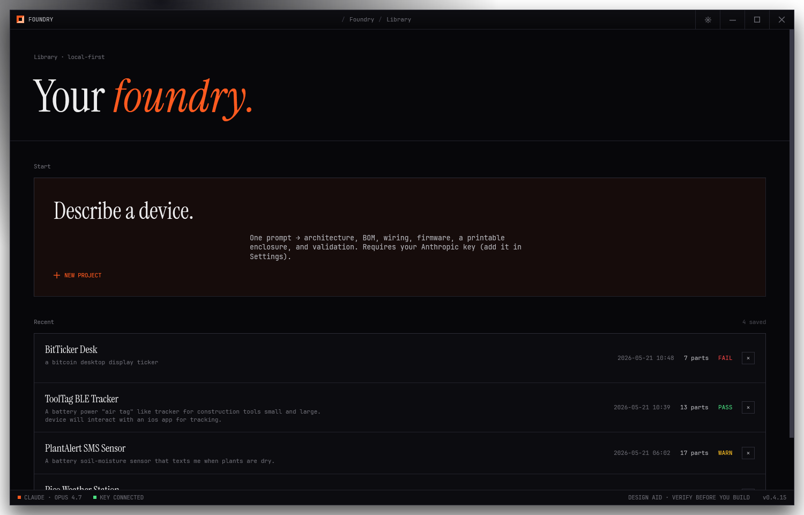
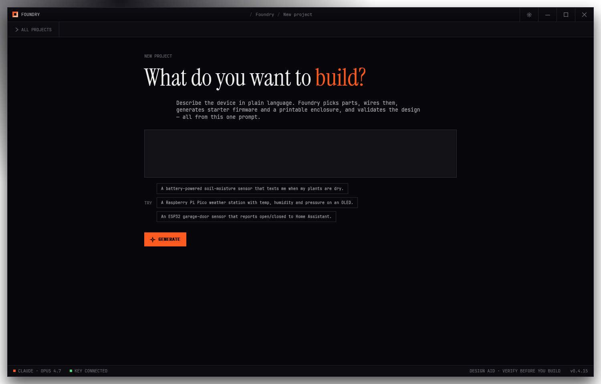
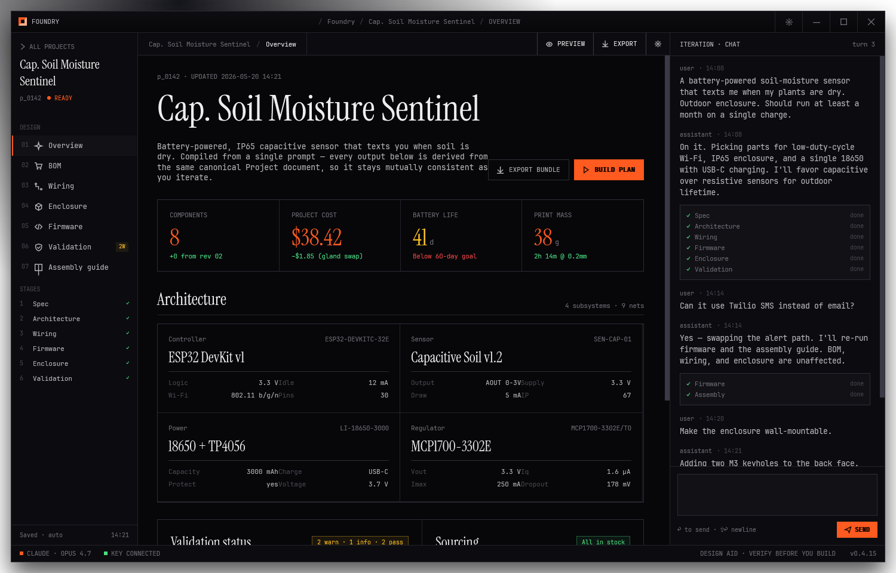
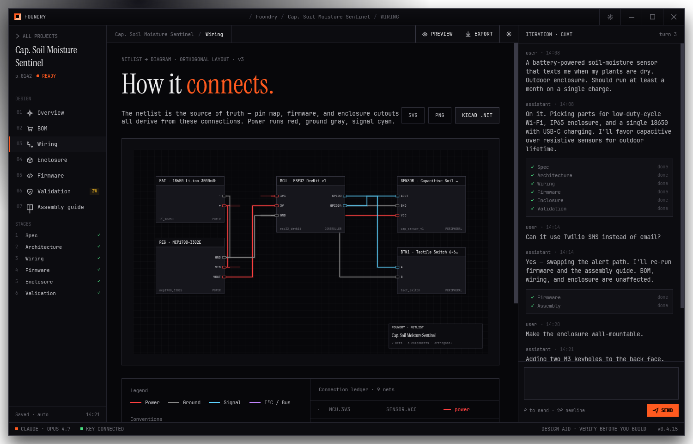
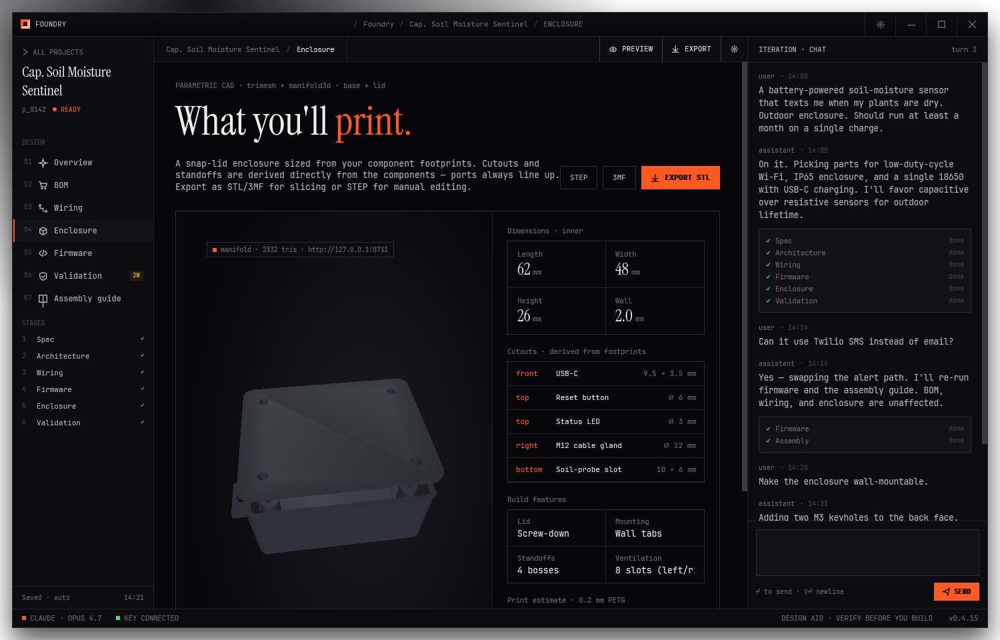
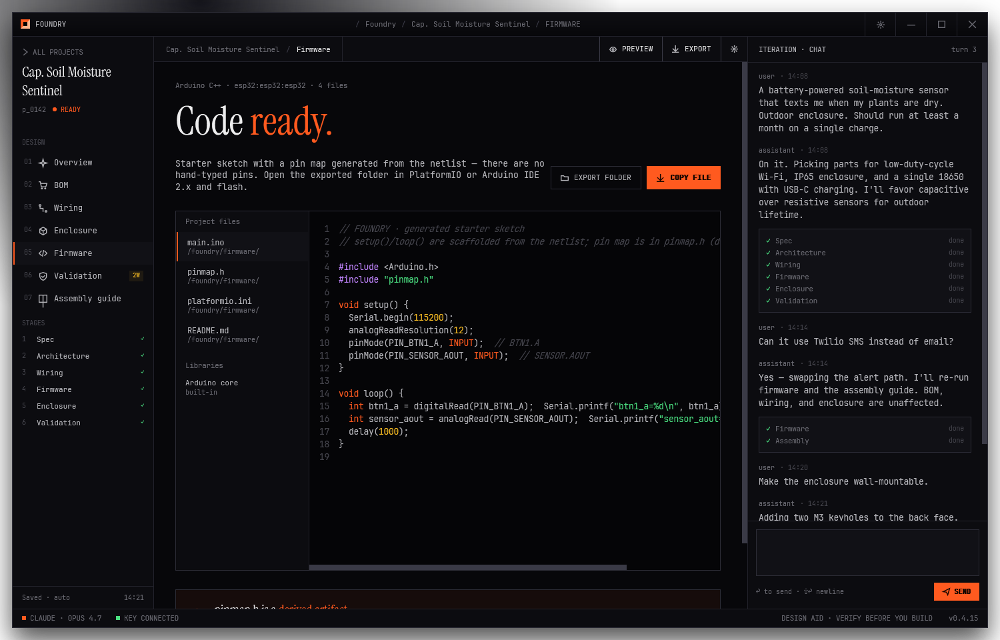
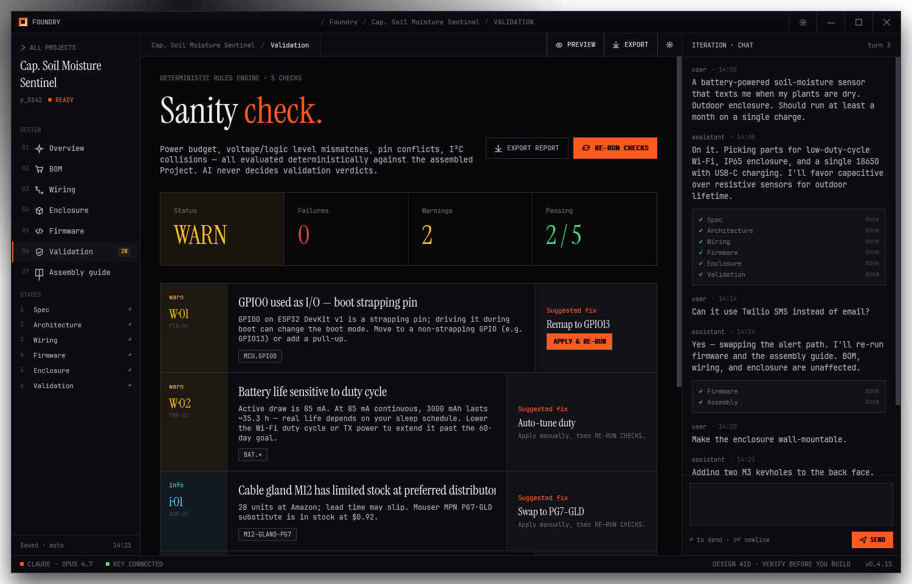
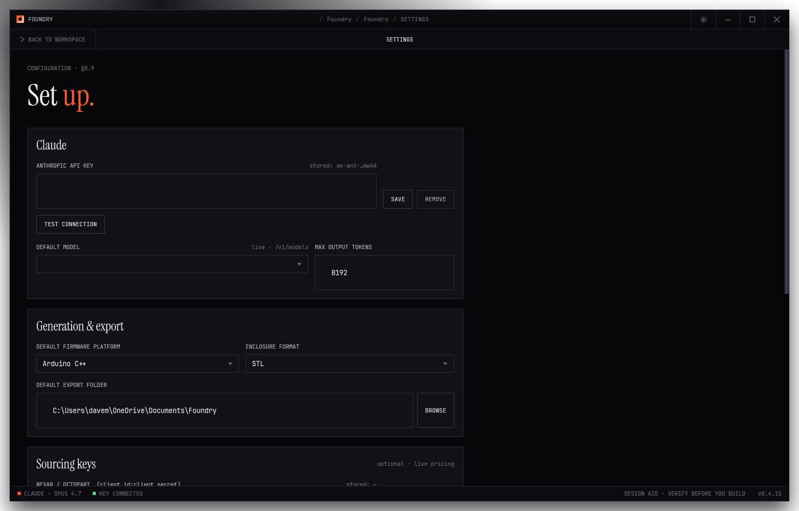

# Foundry

**One prompt → a complete, buildable hardware project.** Foundry is a native Windows 11 desktop app
that turns a plain-language description ("a battery soil-moisture sensor that texts me when my plants
are dry") into a full electronics design: architecture, bill of materials, wiring netlist, **AI-written
firmware**, a **printable 3D enclosure**, and a **deterministic electrical validation** report — all from
one canonical project document, all editable by chat.

[](https://github.com/misterentity/foundry/actions/workflows/release.yml)
[](https://github.com/misterentity/foundry/releases/latest)




> **Design aid — verify before you build.** Foundry's outputs are a strong starting point, not a
> manufacturable spec. Always verify polarity, voltage, and your power supply before applying power.

---

## What it does

You describe a device once. Foundry runs a structured generation pass and produces a single **Project**
document that every tab reads from and writes to:

| Stage | What you get |
| --- | --- |
| **Architecture** | Chosen parts (MCU, sensors, power, etc.) with roles and specs |
| **BOM** | Real parts with MPNs, live pricing (Nexar) + a by-distributor sourcing summary and cart links |
| **Wiring** | An authoritative netlist, auto-laid-out as an orthogonal schematic (power · controller · peripherals) |
| **Firmware** | **Complete, device-specific firmware** written by the AI — real Wi-Fi/MQTT/I²C/ADC logic, with a netlist-derived `pinmap.h` |
| **Enclosure** | A purpose-built 3D-printable case (base + lid, rounded corners, per-port cutouts, ventilation, wall-mount tabs, screw bosses) exported as STL |
| **Validation** | A deterministic rules engine (power budget, voltage/logic levels, pin conflicts, strapping pins, I²C) with one-click auto-fixes |
| **Assembly guide** | Step-by-step build instructions, exportable as a branded PDF |

Then **iterate by chat** — "swap the OLED for e-paper", "add a status LED", "make it solar powered" — and
Foundry revises the whole project and re-runs every downstream stage. Ask a question instead ("why did you
pick this regulator?") and it just answers.

## Screenshots

| New project | Overview |
| --- | --- |
|  |  |

| Wiring (auto-layout from the netlist) | Enclosure (real CSG, base + lid) |
| --- | --- |
|  |  |

| Firmware (AI-written) | Validation (deterministic + auto-fix) |
| --- | --- |
|  |  |

| Settings |
| --- |
|  |

## Highlights

- **AI builds the full solution, not a template.** Firmware is generated per-device (e.g. an ESP32 +
  BME280 → MQTT prompt produces a real `main.ino` with `WiFi`, `PubSubClient`, `Adafruit_BME280` and a
  proper control loop). The pin map is *derived* from the netlist so pins always match the wiring.
- **Validation is deterministic.** The rules engine — never the AI — decides pass/fail, and offers
  bounded auto-fixes (remap a strapping/conflicted pin, connect a missing rail) that re-validate live.
- **Real parametric enclosures.** A `trimesh` + `manifold3d` CAD sidecar builds a watertight case with
  boolean cutouts for every port, ventilation slots, corner screw bosses, and a separate lid.
- **Branded PDF export** of the full project spec and validation report (QuestPDF).
- **Local-first & private.** Projects live on disk; API keys live in Windows Credential Manager (DPAPI).
  Network calls go only to Anthropic, the distributor APIs you configure, and GitHub for updates.
- **System-tray app with self-update**, a diagnostics/audit log of every AI call, and a global progress
  indicator in the status bar.

## How it works

```
┌─────────────────────────── Foundry.App (WPF, .NET 8) ───────────────────────────┐
│  Onboarding · Library · New project · Workspace (7 tabs) · Settings · Diagnostics │
└───────────────┬───────────────────────────────────────────────┬──────────────────┘
                │ MVVM (CommunityToolkit.Mvvm)                    │ HelixToolkit 3D view
        ┌───────▼────────┐                               ┌────────▼─────────┐
        │  Foundry.Core  │  generation · validation ·    │  CAD sidecar      │
        │  (class lib)   │  firmware · sourcing · PDF ·   │  (Python/FastAPI, │
        │                │  project store · diagnostics  │  trimesh+manifold │
        └───┬────────┬───┘                               │  on 127.0.0.1)    │
            │        │                                    └───────────────────┘
   Anthropic API   Nexar / distributors + GitHub Releases
```

- **Foundry.App** — the WPF UI (custom Win11 chrome, design-token theming, code-drawn diagrams).
- **Foundry.Core** — all logic: `ProjectGenerator` (structured Anthropic calls), `RulesEngine` /
  `ProjectValidator`, `FirmwareGenerator` (offline fallback), `PdfExporter`, `ProjectStore` (local
  library), `CredentialStore` (DPAPI), `GitHubUpdater`, `AppLog`.
- **sidecar/** — a tiny FastAPI service spawned on `127.0.0.1` that turns the enclosure schema into an
  STL. Bundled (frozen with PyInstaller) inside the installer, so no Python is needed to run Foundry.

## Install

1. Download **`FoundrySetup.exe`** from the [latest release](https://github.com/misterentity/foundry/releases/latest).
2. Run it. (Builds are currently **unsigned**, so Windows SmartScreen may warn — *More info → Run anyway*.)
3. Launch Foundry, open **Settings → Claude**, paste your **Anthropic API key** (stored in Windows
   Credential Manager — never written to disk), and click **Test connection**.
4. **New project → describe a device → Generate.**

The app lives in the system tray (closing the window minimizes it). **Tray → Check for updates** pulls
new releases; a downloaded update is only run if it's signed by Foundry's publisher.

> You supply your own Anthropic API key and pay Anthropic directly for usage. Generation uses
> `claude-sonnet-4-6` by default (configurable in Settings).

## Build from source

Requirements: .NET 8 SDK, Python 3.12 (for the sidecar), and Inno Setup 6 (for the installer).

```powershell
# app + tests
dotnet test Foundry.Tests
dotnet run --project Foundry.App         # the app spawns the dev sidecar from sidecar/

# freeze the CAD sidecar (optional for dev; required for the installer)
cd sidecar
python -m venv .venv; .venv\Scripts\pip install -r requirements.txt pyinstaller
.venv\Scripts\pyinstaller --noconfirm ../build/sidecar.spec

# self-contained publish + installer
dotnet publish Foundry.App -c Release -r win-x64 --self-contained true -o build/publish
& "$env:LOCALAPPDATA\Programs\Inno Setup 6\ISCC.exe" build/foundry.iss   # → build/AppPackages/FoundrySetup.exe
```

Tagging `vX.Y.Z` triggers the GitHub Actions release pipeline: test → publish → **verify the published
`Foundry.Core.dll` contains the expected types** → freeze the sidecar → build the installer → (sign if a
cert is configured) → publish the release.

## Security & privacy

- **API keys** are stored only in **Windows Credential Manager** (DPAPI-backed). They are never written
  to project files, `config.json`, or logs; the UI only shows masked summaries.
- **Projects** are plain JSON under `%AppData%\Foundry\projects` — no secrets, no cloud account.
- **The CAD sidecar** binds to `127.0.0.1` only and accepts a numeric geometry schema (no file paths, no shell).
- **The auto-updater** pins the release repo at build time and only executes a downloaded installer that
  is Authenticode-signed by the same publisher as the running app. See [`build/SIGNING.md`](build/SIGNING.md).
- **Logs** (`%AppData%\Foundry\logs`) record AI-call *metadata only* (model, sizes, duration, status) —
  never prompts or keys.

## Tech stack

.NET 8 · WPF · CommunityToolkit.Mvvm · HelixToolkit.Wpf (3D) · QuestPDF (PDF) · Anthropic Messages API ·
Python · FastAPI · trimesh + manifold3d + shapely (CAD) · PyInstaller · Inno Setup · GitHub Actions.

## Status

**v1.0** — all PRD functional requirements (F1–F12) and acceptance criteria met. The two
externally-gated items are activation-only: **code-signing** (add a cert to remove the SmartScreen
warning — pipeline is wired) and **live Nexar pricing** (add a Nexar key in Settings; BOM uses
estimates + cart links otherwise). See [`GO_LIVE.md`](GO_LIVE.md).

## License

**Proprietary — © 2026 Dave MacNeill. All rights reserved.** The source is published for transparency
and portfolio purposes; no rights to copy, modify, or redistribute are granted. See [`LICENSE`](LICENSE).

---

*Foundry is a personal project and is not affiliated with Anthropic. "Claude" is a trademark of Anthropic.*
