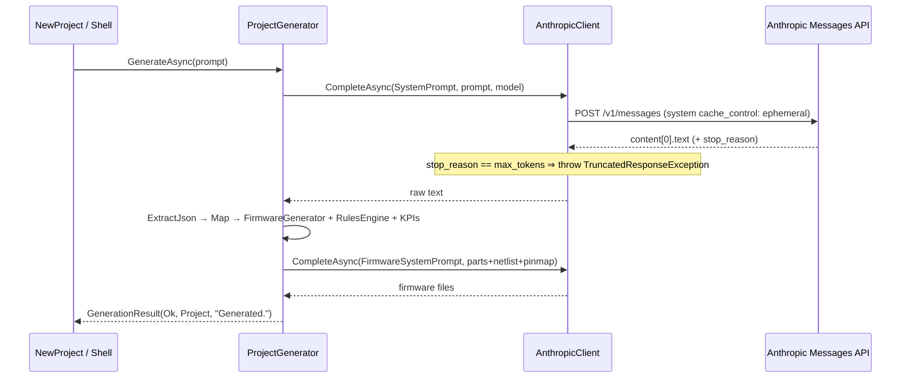

# Generation — prompt → Project via Claude

> **What's in this doc:** the two-pass generation flow (design pass → firmware pass), the JSON contract with the model, defensive parsing and the retry, truncation handling, the revise/Q&A/force-edit modes, which model ids are used where, and the hard line between what the AI decides and what the deterministic engines decide.
>
> **What's NOT:** compiling or flashing the generated firmware (→ [[firmware]]); the placement-intent AI call, which is a separate fenced contract (→ [[pcb]]); how the resulting `Project` is persisted (→ `Foundry.Core/Project/ProjectStore.cs`, not yet documented — see [[_backlog]]); the chat UI (→ [[desktop-ui]]).

## The determinism boundary

The model designs; it does not adjudicate. `ProjectGenerator` takes the model's JSON and then **recomputes the safety-relevant fields locally** — see `Foundry.Core/Generation/ProjectGenerator.cs:12-16` and the post-parse block at `Foundry.Core/Generation/ProjectGenerator.cs:334-351`:

| Field | Source |
|---|---|
| `Subsystems`, `Bom`, `Connections`, `Enclosure`, `Assembly`, `Components` | model JSON (`:326-331`) |
| `Firmware` (baseline) | `FirmwareGenerator.Generate` (`:338`) |
| `Findings` / `Validation` verdict | `RulesEngine.Validate` (`:339-341`) — never the model |
| `Kpis` (parts, cost, current, print grams) | computed from the BOM/KB (`:343-351`) |

The pin map handed to the firmware pass is likewise derived from the netlist, not asked for: `PinMap.Build(project.Connections, kb)` at `Foundry.Core/Generation/ProjectGenerator.Firmware.cs:19`.

## Flow

### Pass 1 — design

`Foundry.Core/Generation/ProjectGenerator.cs:104` — `GenerateAsync`.

- Refuses early without a key or prompt (`:106-109`).
- **Logs only the prompt's length, never its body** — `AppLog` persists to disk and is documented never to contain prompts (`:111-113`).
- Two attempts. Attempt 2 appends a stricter compact-JSON nudge (`:118-123`).
- `ExtractJson` (`:312`, delegating to `Foundry.Core/Generation/JsonText.cs`) tolerates stray fences/prose by extracting the outermost object.
- A parse failure after the retry returns an error result, never a partial project (`:147`).

The JSON contract itself is the `SystemPrompt` literal at `Foundry.Core/Generation/ProjectGenerator.cs:29-102` — a worked example of the exact shape (`title`, `summary`, `subsystems`, `components` with typed pins, `bom`, `connections`, `enclosure`, `firmwarePlatform`, `assembly`) followed by an explicit OUTPUT CONTRACT section at `:59`. Changing the shape means changing that literal *and* the `Map*` helpers below it.

### Pass 2 — firmware

`Foundry.Core/Generation/ProjectGenerator.Firmware.cs:14` — `EnrichFirmwareAsync`, called at `Foundry.Core/Generation/ProjectGenerator.cs:161`.

The prompt supplies parts, netlist, and the **pre-computed pin map**, and forbids the model from redefining pins (`Foundry.Core/Generation/ProjectGenerator.Firmware.cs:32-36`). After the reply, the derived pin map is re-injected authoritatively — any model-supplied `pinmap.h`/`pinmap.py` is removed first (`:57-58`).

Every failure path keeps the deterministic firmware from pass 1 rather than shipping something worse, and **says so in the log**: unparseable JSON (`:42-45`), zero files (`:49-53`), any exception (`:63-66`).

## Truncation is never silent

A `stop_reason` of `max_tokens` means the JSON is cut mid-object. `AnthropicClient.CompleteAsync` refuses to return that partial text — it logs a WARN and throws `TruncatedResponseException` (`Foundry.Core/Ai/AnthropicClient.cs:127-137`; the pure predicate is `IsTruncated` at `Foundry.Core/Ai/AnthropicClient.cs:209`).

`GenerateAsync` catches it specifically (`Foundry.Core/Generation/ProjectGenerator.cs:126-135`): attempt 1 retries with the compact nudge; attempt 2 fails honestly and tells the user to raise the output-token limit. The two log lines are deliberately distinguishable — if you see only the "could not parse JSON" WARN (`:145`) without the client's "TRUNCATED" WARN, the model stopped normally and just emitted bad JSON (`:142-144`).

## Revise, Q&A, and force-edit

`ReviseAsync` (`Foundry.Core/Generation/ProjectGenerator.cs:171`) sends the current design plus the request and picks one of two system prompts:

- **`ReviseSystemPrompt`** (`:234-242`) — the model decides whether the message is a question (reply in prose) or a change (return the full updated JSON). A prose reply is surfaced as a chat answer with no project change (`:197-199`).
- **`EditOnlySystemPrompt`** (`:244-251`) — used with `forceEdit: true` (e.g. validation auto-fix). A prose-only reply is a **failure**, not an answer (`:192-196`). This prompt also states the concrete remedies expected for strapping-pin conflicts, logic-level mismatches, and missing rails.

Two behaviours worth knowing before you touch this:

- Library identity survives a revision: `Id` and `Prompt` are copied back from the current project (`:206-207`).
- The firmware pass is **skipped** when the netlist and platform are unchanged (`:209-219`), compared via the order-insensitive `SameNetlist` at `:225-232`. This is a large speed win and the reason a cosmetic edit doesn't rewrite your firmware.

`SuggestAlternatesAsync` (`:283`) is the third call site, for ranked BOM substitutes.

## Client and models

`Foundry.Core/Ai/AnthropicClient.cs:15` — plain `HttpClient` against `https://api.anthropic.com`, `anthropic-version: 2023-06-01` (`:17-18`).

- One **shared, long-lived** `HttpClient`; the key is per-request, so disposing an `AnthropicClient` must not tear it down (`:20-23`, `:159`).
- A process-wide semaphore serializes every call into a FIFO queue, so requests never overlap and the status bar can show queue depth (`:25-27`, `:94`).
- The system block is sent with `cache_control: ephemeral` for prompt caching, since the same stable system prompt is re-sent across turns (`:103`, `:191-194`).
- Errors are unwrapped from the API envelope before being thrown/logged (`:117-119`, `:149-157`).
- Every call is recorded by `AppLog.Ai` with **metadata only** — model, sizes, duration, status (`:138`).

Model ids live in `Foundry.Core/Ai/ModelCatalog.cs`:

| Constant | Value | Used for |
|---|---|---|
| `DefaultModelId` (`:12`) | `claude-sonnet-4-6` | chat/edits, and the fallback when no model is configured (`ProjectGenerator.cs:26`) |
| `GenerationModelId` (`:16`) | `claude-opus-4-8` | full project generation |

`ModelCatalog.Fallback` (`:18`) is the offline list used when `GET /v1/models` fails — that call is also the cheap key-validation path (`Foundry.Core/Ai/AnthropicClient.cs:52-53`).

`IAnthropicClient` (`Foundry.Core/Ai/IAnthropicClient.cs:7`) is the seam tests substitute; `Foundry.Core/Ai/StubAnthropicClient.cs` and `Foundry.Core/Ai/StubPipeline.cs` are the offline implementations.

## Editing this domain safely

- **Widening the JSON contract** means three coordinated edits: the `SystemPrompt` literal, the matching `Map*` helper, and a number-reading path. Numbers come back inconsistently typed (`3000.0`, `"2.0"`), which is why `Foundry.Core/Generation/ProjectGenerator.cs:484-485` exists — use it rather than `GetInt32`.
- **Never move a recomputed field to the model's answer.** Findings, KPIs, and the pin map are locally computed on purpose.
- **Never log prompt or firmware bodies.** The privacy claim in the README depends on `:111-113` staying true.
