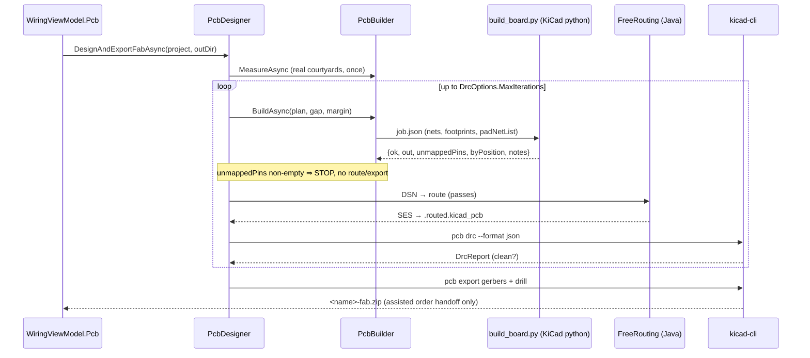

# Auto-PCB — placement, routing, DRC, fab handoff

> **What's in this doc:** the Track B pipeline (netlist → job JSON → `pcbnew` board → FreeRouting → `kicad-cli` DRC → Gerber ZIP → assisted fab order), the pin→pad resolution chain and its fail-closed gate, the deterministic DRC fix loop and its bump schedule, where the AI is fenced, and the CI lane that gates the whole thing.
>
> **What's NOT:** how the netlist itself is produced from a prompt (→ [[generation]]); arduino-cli compile/flash (→ [[firmware]]); how KiCad/FreeRouting/Java get onto the machine and what verifies those downloads (→ [[provisioning]]); the PCB tab's UI wiring (→ [[desktop-ui]]).

## The invariant this domain exists to protect

**A board is only produced when every net pin is provably on the pad it names.** Foundry's failure mode of record is not "no board" — it is *a confidently-wrong board*: a real footprint whose pads got assigned by ordinal position, so `GPIO34` silently lands on pad 6's neighbour and the user pays a fab house for it. Every mechanism below (the symbol-derived pin maps, the `is_fallback` distinction, the unmapped-pin gate, the connectivity refusal before routing) exists to make that outcome impossible rather than unlikely.

Two rules follow, and they are load-bearing:

1. **The AI never emits geometry.** `PcbPlanner` is fenced to placement *intent* (functional groups, edge/near hints); `PcbPlacer` owns every coordinate — see `Foundry.Core/Pcb/PcbPlacer.cs:4-11` and `Foundry.Core/Pcb/PcbPlanner.cs:9-14`.
2. **An unresolved pin fails the build; it is never guessed.** `Foundry.Core/Pcb/KiCadScripts/build_board.py:137`.

## Pipeline



Entry points, in the order a change usually travels:

- `Foundry.Core/Pcb/PcbDesigner.cs:79` — `DesignAsync`: locate KiCad, get an initial plan, measure footprints once, wire the four steps, run the loop.
- `Foundry.Core/Pcb/PcbDesigner.cs:120` — `DesignAndExportFabAsync`: the v2.6 capstone; only exports when `design.Ok` (a DRC-clean board is the contract for fab) at `Foundry.Core/Pcb/PcbDesigner.cs:125`.
- `Foundry.Core/Pcb/PcbDesigner.cs:146` — `RunLoopAsync`: the pure control flow, driven by injected delegates so tests exercise it with no KiCad, no Java, no AI.
- `Foundry.App/ViewModels/Tabs/WiringViewModel.Pcb.cs:296` — `DesignAndExportFab`, the UI command that drives the whole chain.

## Pin → pad resolution (the moat)

A Foundry netlist endpoint is `ALIAS.PIN`, where PIN is a *logical* name (`GPIO34`, `VCC`, `SDA`) — see `Foundry.Core/Pcb/FootprintMap.cs:287-297`. A KiCad pad is addressed by `pad.GetName()`, usually a number. Bridging those two namespaces correctly is the entire moat.

`Foundry.Core/Pcb/PcbJob.cs:121-127` runs a four-step chain per pin, first hit wins:

| # | Resolver | Keyed on | When it applies |
|---|---|---|---|
| 1 | `McuPinMap.ResolvePad` (`Foundry.Core/Pcb/McuPinMap.cs:32`) | footprint lib id | curated, KiCad-free, chip-specific aliases |
| 2 | `SymbolPinMap.ResolvePad` (`Foundry.Core/Pcb/SymbolPinMap.cs:36`) | footprint lib id | part-specific module footprints (ESP32-WROOM, Pico, Uno, Nano) |
| 3 | `SymbolPinMap.ResolvePadBySymbol` (`Foundry.Core/Pcb/SymbolPinMap.cs:47`) | **part identity** via `ChipCatalog` | bare chips in a *generic* package (LQFP-48, DIP-28) |
| 4 | *(none)* — keep the logical name | — | falls through to the fail-closed gate and is **refused** |

Step 3 exists because a footprint like `Package_QFP:LQFP-48_7x7mm_P0.5mm` is shared by hundreds of unrelated chips, so the footprint cannot identify the pinout. `Foundry.Core/Pcb/ChipCatalog.cs:12-26` therefore keys on the component *name*, and the header comment at `Foundry.Core/Pcb/ChipCatalog.cs:17` states the rule that keeps it safe: keywords must be specific to one part — a bare `stm32` token mapping every STM32 to one variant is exactly the mis-map this mechanism exists to prevent.

### Symbol parsing

`SymbolPinMap` derives authoritative maps from KiCad's own `.kicad_sym` libraries rather than transcribed tables (`Foundry.Core/Pcb/SymbolPinMap.cs:6-18`). Three details matter when editing it:

- The footprint→symbol pointer table is at `Foundry.Core/Pcb/SymbolPinMap.cs:22-29`; a footprint not in it falls back to splitting `Lib:Name` as an identity guess (`Foundry.Core/Pcb/SymbolPinMap.cs:60`).
- **Derived symbols carry no pins.** `Arduino_Nano_v3.x` and `ATmega328-P` inherit via `(extends "Parent")`; the parser follows the pointer with a depth guard of 4 at `Foundry.Core/Pcb/SymbolPinMap.cs:65` and `Foundry.Core/Pcb/SymbolPinMap.cs:99-100`.
- Name canonicalization is **universal only** — `IOnn→GPIOnn`, `GPIO26_ADC0→GPIO26`, `GPn→GPIOn`, `VDD/VCC→3V3`, `VSS→GND` (`Foundry.Core/Pcb/SymbolPinMap.cs:108-125`). Chip-specific aliases belong in `McuPinMap`, not here.

### The fail-closed gate

`build_board.py` assigns pads in two passes (`Foundry.Core/Pcb/KiCadScripts/build_board.py:94`):

1. **By name**, case-insensitive (`…/build_board.py:116-130`).
2. **By ordinal position — only when safe** (`…/build_board.py:132-153`). "Safe" means one of exactly two things, and the condition is the single most important line in this domain:

   ```python
   if not (is_fallback or pin.isdigit()):   # build_board.py:137
   ```

   `is_fallback` is true only when `FootprintMap` could not resolve a real part and dropped in a generic placeholder header (`Foundry.Core/Pcb/FootprintMap.cs:146-147`, carried on the job at `Foundry.Core/Pcb/PcbJob.cs:26-29`). `pin.isdigit()` covers genuinely positional references like `J1.1`. Anything else — a logical name on a *resolved real* footprint — is recorded as unmapped and the build fails.

The refusal then propagates three times, deliberately:

- `…/build_board.py:255` — `ok = len(unmapped) == 0`; the script does not claim success.
- `Foundry.Core/Pcb/PcbResult.cs:85-89` — parsing forces `ok = false` **before** the file-exists check, so a saved-but-mis-wired board is rejected rather than returned.
- `Foundry.Core/Pcb/PcbDesigner.cs:168-174` — the loop refuses to route, DRC, or export: *"a confidently-wrong fab board is worse than no board."*

`byPosition` (`Foundry.Core/Pcb/PcbResult.cs:24`) records the ordinal placements that *were* allowed, so a reviewer can audit them.

## Footprint choice and placement

`FootprintMap.Resolve` (`Foundry.Core/Pcb/FootprintMap.cs:37`) picks a lib id by priority: explicit `ComponentSpec.Footprint` (`:39`) → `ChipCatalog` match (`:44`) → keyword heuristics (passives `:55-74`, modules `:77-90`, packages `:132-137`, connectors `:140-143`) → a pin-count-correct generic header, flagged `IsFallback` (`:146`).

Sizes come from two places, and the distinction matters for reproducibility:

- **Real geometry** — `PcbBuilder.MeasureAsync` (`Foundry.Core/Pcb/PcbBuilder.cs:115`) runs `build_board.py measure` against the lib ids from `PcbJob.ResolvedLibIds` (`Foundry.Core/Pcb/PcbJob.cs:153`). `PcbDesigner` calls it **once** and reuses the result across re-place iterations (`Foundry.Core/Pcb/PcbDesigner.cs:92-97`) — geometry doesn't change between iterations, only gap/margin do.
- **Offline approximation** — `FootprintMap.CourtyardOf` (`Foundry.Core/Pcb/FootprintMap.cs:163`), a table-driven fallback used per-lib-id when KiCad is absent or a measure is missing (`Foundry.Core/Pcb/PcbJob.cs:103-104`). Never returns 0; unmatched ids get a generous 10×10 (`Foundry.Core/Pcb/FootprintMap.cs:230`).

`PcbPlacer.Place` (`Foundry.Core/Pcb/PcbPlacer.cs:52`) then produces collision-free coordinates plus a board outline. It is pure, deterministic (ties broken by ref), and cannot emit an overlapping or off-board layout.

### Default placement

With an AI plan, `PackGroup` shelf-packs each functional group. **With no plan, `Grid` now First-Fit-Decreasing-Height bin-packs** into a squarish board derived from the true total area.

It previously used a uniform grid whose cells were sized to the *largest* part in both axes, so a single big component inflated every cell — the demo's 88 mm 18650 holder produced a 220 × 48 mm board of mostly empty copper, and since [[enclosure]] derives the case from this outline, the enclosure was wrong too. Packing the same parts now gives 102 × 67 mm.

Two invariants hold and are tested in `Foundry.Tests/PcbPlacementTests.cs`: no pair of inflated courtyards ever overlaps, and a board is never narrower than its widest part but never a multiple of it either. Processing tallest-first means the first box on a shelf is the tallest it will hold, so shelf heights are fixed at creation and a later item can never foul the row above.

## The DRC fix loop

`RunLoopAsync` (`Foundry.Core/Pcb/PcbDesigner.cs:146`) is bounded by `DrcOptions.MaxIterations` — **default 3**, alongside `Strict = false` (errors only) and `Units = "mm"` (`Foundry.Core/Pcb/DrcOptions.cs:9`) — and **keeps the best board seen** — fewest errors, then fewest unconnected, then fewest warnings, with clean always winning (`Foundry.Core/Pcb/PcbDesigner.cs:246-253`). A partial improvement is never thrown away; `KicadPcbPath` is the best board even when the loop exhausts.

Remediation is deterministic first, AI second. The bump schedule is monotonic — each rung strictly loosens (`Foundry.Core/Pcb/PcbDesigner.cs:47-53`):

| knob | rung 0 | rung 1 | rung 2 | bumped when the dominant violation class is |
|---|---|---|---|---|
| gap (mm) | 2.0 | 3.0 | 4.5 | `clearance`, `hole_clearance`, `courtyards_overlap` (`:258-261`) |
| margin (mm) | 5.0 | 7.0 | 10.0 | `copper_edge_clearance` (`:255-256`) |
| router passes | 10 | 20 | 40 | `unconnected_items`, `track_dangling`, `via_dangling` (`:263-266`) |

The AI plan revision (`PcbPlanner.RevisePlanAsync`, `Foundry.Core/Pcb/PcbPlanner.cs:96`) fires only when a bump cannot help *or* clearance congestion persists past the first remediation — `Foundry.Core/Pcb/PcbDesigner.cs:225-231`. It returns advice in the same fenced JSON contract; any failure keeps the current plan unchanged.

Progress is legible by design: each iteration appends one trace line including the error-count delta (`Foundry.Core/Pcb/PcbDesigner.cs:197-201`).

## External tool invocation

Every external call goes through `Diagnostics.ProcessRunner` (concurrent stdout/stderr drain, timeout, process-tree kill) — `Foundry.Core/Pcb/PcbBuilder.cs:171-175`, `Foundry.Core/Pcb/PcbRouter.cs:96-101`, `Foundry.Core/Pcb/PcbDrc.cs:89-93`.

- **Build** — KiCad's *bundled* python is the only interpreter that can `import pcbnew` (`Foundry.Core/Pcb/KiCadInstaller.cs:9`, `:52-54`). The script is an embedded resource written to a temp dir per run (`Foundry.Core/Pcb/PcbBuilder.cs:19`, `:81-84`).
- **Route** — Specctra DSN out, FreeRouting headless, SES back in (`Foundry.Core/Pcb/PcbRouter.cs:24`); the jar invocation is at `Foundry.Core/Pcb/PcbRouter.cs:61-62`. The router only *locates* the jar; it never fetches it.
- **DRC** — `kicad-cli`, **not** python (`Foundry.Core/Pcb/PcbDrc.cs:21`). Args are built purely and unit-testably at `Foundry.Core/Pcb/PcbDrc.cs:64`; `--severity-warning` is added only in strict mode (`:74`). Schematic-parity is deliberately omitted — there is no `.kicad_sch` in Track B and enabling it would false-fail (`Foundry.Core/Pcb/PcbDrc.cs:61-62`).
- **Symbols** — `KiCadInstaller.Install.SymbolDir` is derived as a sibling of the footprint dir (`Foundry.Core/Pcb/KiCadInstaller.cs:42-43`); a missing dir simply disables step 2/3 of the resolution chain (`Foundry.Core/Pcb/PcbBuilder.cs:70`).

Absence of any tool degrades to `NotInstalled` — never a throw (`Foundry.Core/Pcb/PcbResult.cs:26`, `Foundry.Core/Pcb/PcbDesigner.cs:24`).

## Fab export and ordering

`GerberExporter.ExportAsync` (`Foundry.Core/Pcb/Fab/GerberExporter.cs:79`) produces the layer set + drill files and bundles `<name>-fab.zip`. It re-runs DRC itself unless the caller already gated the board — `PcbDesigner` passes `drcClean: true` to skip the redundant run (`Foundry.Core/Pcb/PcbDesigner.cs:133-136`, checked at `Foundry.Core/Pcb/Fab/GerberExporter.cs:94`).

Ordering is an **assisted handoff and never a submission**:

- `IFabProvider` (`Foundry.Core/Pcb/Fab/FabProvider.cs:57`) — quote + *prepare*; providers degrade rather than throw.
- `FabOrderHandoff` (`Foundry.Core/Pcb/Fab/FabProvider.cs:42`) — a portal URL, clipboard params, and the ZIP path. The user finishes on the fab's site; Foundry never auto-submits and never pays (`Foundry.Core/Pcb/Fab/FabService.cs:27-31`).
- Provider selection mirrors sourcing: keyed PCBWay (live quotes) → keyed JLCPCB (estimate + handoff) → `NullFabProvider` (`Foundry.Core/Pcb/Fab/FabService.cs:18`, `:61-63`).
- A quote is labelled `Estimate` or `Live` and an estimate is never presented as binding (`Foundry.Core/Pcb/Fab/FabProvider.cs:19-28`).

## What gates a change here

The `pcb-live` CI lane is the correctness gate — it installs real KiCad, fetches the pinned FreeRouting jar, and **reads pad→net back off the built board to assert it equals intent**, including the fail-closed refusal of an unmapped logical pin: `.github/workflows/ci.yml:47` (lane), `:84` (the assertion step). It runs on PRs and pushes to `main`, so a net→pad regression cannot reach `main`. The release workflow mirrors it at `.github/workflows/release.yml:129`.

Pure pad-assignment logic is additionally covered without KiCad by pytest: `.github/workflows/ci.yml:39-42` over `Foundry.Core/Pcb/KiCadScripts/test_build_board.py`.

**When you change pin resolution, footprint mapping, or `assign_pads`, a green `dotnet test` is not sufficient evidence.** The unit suite runs without KiCad; only the `pcb-live` lane proves pads still carry the nets they claim.
